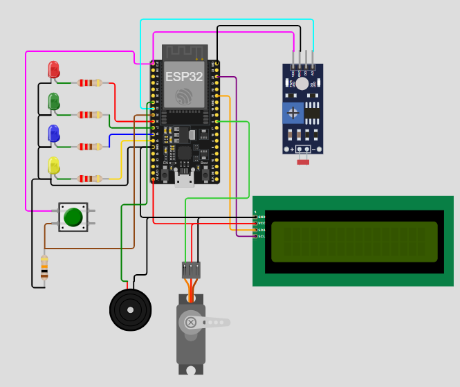

# IoT 2026 - Lab 2 Template

You need to finish following 10 exercises

### Setup Configuration in this Wokwi Project template:

- RED LED - `D26`
- Green LED - `D27`
- Blue LED - `D14`
- Yellow LED - `D12`

- Button (Active high) - `D25`
- Light sensor (analog) - `D33`

- LCD I2C - SDA: `D21`
- LCD I2C - SCL: `D22`

- Servo Motor: `D5`

- Buzzer: `D32`

## 1) Blink RED LED
- Turn **RED (D26)** ON for 500 ms, then OFF for 500 ms in a loop.  
- Serial: Print `RED ON` / `RED OFF` whenever it changes.

---

## 2) Button toggles GREEN
- Press **BUTTON (D25)** to toggle **GREEN (D27)**.  
- Serial: Print `GREEN=1` or `GREEN=0` only when the state changes.

---

## 3) Read light sensor
- Every 500 ms, read **LIGHT (D33)** using `analogRead()`.  
- Serial: Print the raw value, e.g. `raw=1835`.

---

## 4) Light sensor -> LED band
- Read **LIGHT (D33)** and turn ON exactly one LED based on value (0–4095):  
  - 0–1023 → **BLUE (D14)**  
  - 1024–2047 → **GREEN (D27)**  
  - 2048–3071 → **YELLOW (D12)**  
  - 3072–4095 → **RED (D26)**  
- Serial: Print `band=BLUE/GREEN/YELLOW/RED`.

---

## 5) Snapshot on button
- Do nothing until **BUTTON (D25)** is pressed.  
- On press, read **LIGHT (D33)** once and print `snapshot=xxxx`.  
- Flash **YELLOW (D12)** for 100 ms to acknowledge (change 100ms if needed)

---

## 6) Minimal serial control
- If serial receives a character:  
  - `'B'` → turn **BLUE (D14)** ON  
  - `'b'` → turn **BLUE (D14)** OFF  
- Serial: Print `BLUE=1` or `BLUE=0` after each command.

---

## 7) LED chase (Knight Rider)
- Cycle through **RED (D26) → GREEN (D27) → YELLOW (D12) → BLUE (D14) → YELLOW (D12) → GREEN (D27)** and repeat, turning on one LED at a time for 150 ms while the others stay OFF.  
- Keep track of the step index in a variable (do not use `delay()` chains longer than one step - use a single `delay(150)` per loop iteration).  
- Serial: Print the name of the LED that just turned on, e.g. `chase=RED`.

---

## 8) Serial-only sensor statistics
- Every 1000 ms, take **10 back-to-back `analogRead()` samples** of **LIGHT (D33)** (no delay between the samples themselves).  
- Compute the **minimum**, **maximum** and **average** of those 10 samples.  
- No LEDs are used in this exercise.  
- Serial: Print one line per second in the format `min=120 max=340 avg=210`.

---

## 9) Sensor threshold alert with hysteresis
- Every 300 ms, read **LIGHT (D33)**.  
- Maintain a boolean `alertActive` state:  
  - If the reading rises **above 3000** and the alert is not already active, set it active.  
  - If the reading drops **below 2500** and the alert is active, clear it.  
  (This gap between 2500 and 3000 prevents rapid flickering.)  
- No LEDs are used in this exercise.  
- Serial: Print `ALERT=1` only the moment it becomes active, and `ALERT=0` only the moment it clears (not on every loop).

---

## 10) Button press counter with pattern
- Detect **BUTTON (D25)** presses using proper edge detection (act once per press, not once per loop while held).  
- Keep a press counter that increases by 1 on each press and wraps back to 0 after reaching 4.  
- Based on the counter value, light up exactly that many LEDs simultaneously, in this fixed order: **RED (D26)**, then **GREEN (D27)**, then **YELLOW (D12)**, then **BLUE (D14)** (e.g. counter=2 → RED and GREEN ON, YELLOW and BLUE OFF).  
- Serial: Print `count=<n>` every time the counter changes.
